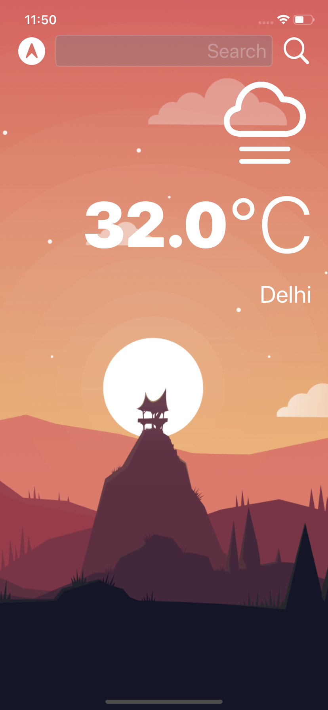
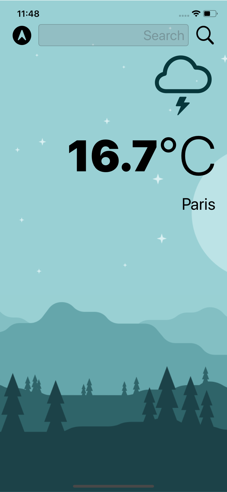

# Clima
A simple weather App using OpenWeatherMap API with geolocation for iOS, iPad and MacOS(Project Catalyst). 


 &nbsp;&nbsp;&nbsp;&nbsp;&nbsp;&nbsp;  
This App supports both light and dark mode. It also contains search bar to search for cities.  

## Installation
Download or clone the repository to Xcode.
To run this App first get your personal API key from  [OpenWeatherMap](https://openweathermap.org/api) and paste the API key in weatherURL inside WeatherManager.swift file.  

```swift
let weatherURL = "https://api.openweathermap.org/data/2.5/weather?appid='Enter-you-api-key-here'&units=metric"
    

```
Then finally change the Signing & Capabilties and change the Bundle Identifier. Run the project on Simulator, Mac or an actual physical iPhone and iPad . Enjoy :smile:.

## License
[MIT](https://choosealicense.com/licenses/mit/)
